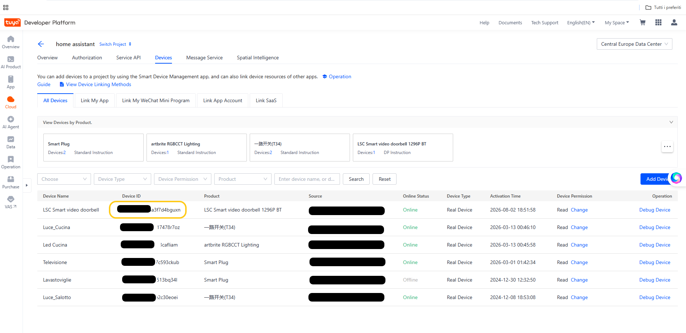
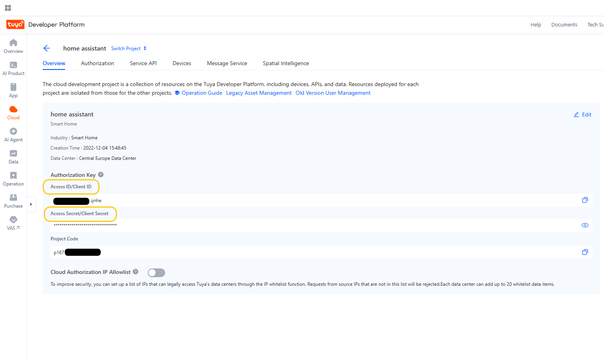
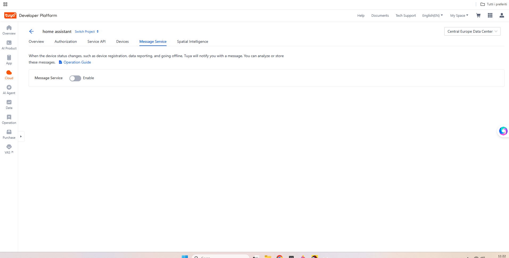
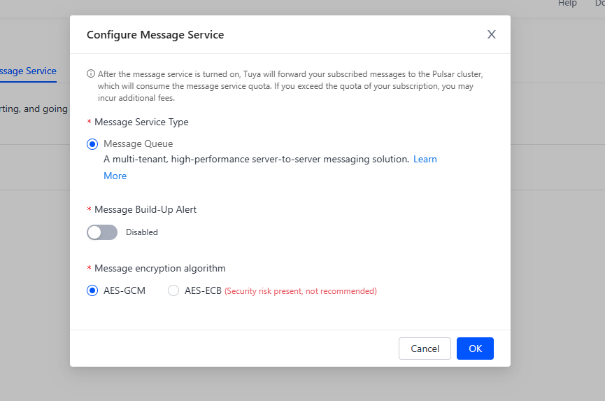
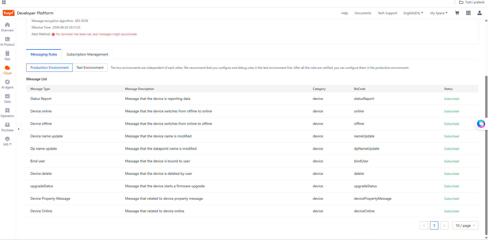
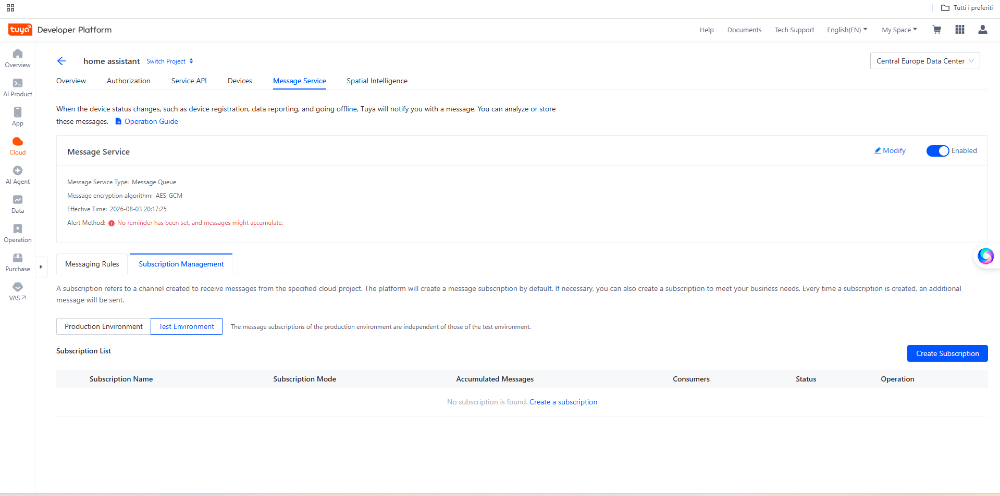
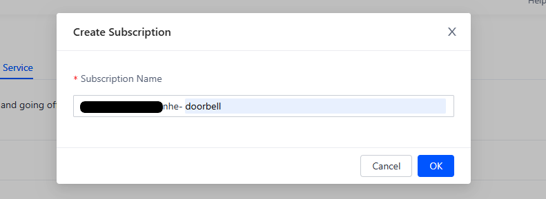

# Complete installation and configuration guide

This guide explains how to install and configure **LSC Doorbell Event Bridge 1.0.0** from start to finish.

The setup has two parts:

1. Add the Smart Life/Tuya account and doorbell to the official Home Assistant Tuya integration.
2. Create a Tuya Cloud project and Message Service subscription for real-time doorbell events.

> [!IMPORTANT]
> Never publish your Tuya Access Secret, device IDs, subscription name, account QR codes, UUIDs, or private snapshot paths. Replace or blur those values before adding screenshots to this repository.

## Requirements

- Home Assistant OS or another installation type with the Home Assistant App store.
- The doorbell already paired with the **Smart Life** or **Tuya Smart** mobile app.
- The official Home Assistant **Tuya** integration.
- The **Mosquitto broker** App and the Home Assistant **MQTT** integration.
- A free Tuya Developer Platform account.
- A second screen for QR-code scans.

---

> [!TIP]
> **Already using the official Tuya integration and an existing Tuya Cloud project?**  
> Jump directly to [Step 11 — Verify linked devices and copy the Device ID](#step-11--verify-linked-devices-and-copy-the-device-id).

# Part 1 — Add Tuya and the doorbell to Home Assistant

## Step 1 — Add the doorbell to Smart Life

1. Install **Smart Life** or **Tuya Smart** on your phone.
2. Sign in or create an account.
3. Pair the LSC doorbell in the mobile app.
4. Confirm that live video and device controls work in the app.

## Step 2 — Find the Smart Life User Code

1. Open the Smart Life app.
2. Select **Me**.
3. Open the gear icon in the upper-right corner.
4. Select **Account and Security**.
5. Copy the **User Code** shown at the bottom of the page.

You will need this code while adding the official Tuya integration to Home Assistant.

## Step 3 — Add the official Tuya integration

1. In Home Assistant, open **Settings → Devices & services**.
2. Select **Add integration**.
3. Search for **Tuya**.
4. Select the official Tuya integration and follow the on-screen instructions.
5. Enter the Smart Life User Code when requested.

Official Home Assistant documentation: <https://www.home-assistant.io/integrations/tuya/>

## Step 4 — Scan the Home Assistant QR code

1. Keep the Home Assistant QR code visible on a second screen.
2. Open Smart Life on your phone.
3. Select **+ → Scan** or open the QR-code scanner.
4. Scan the QR code displayed by Home Assistant.
5. Confirm the authorization in Smart Life.

## Step 5 — Verify the imported devices

1. Return to **Settings → Devices & services → Tuya**.
2. Open the Tuya integration.
3. Confirm that your Smart Life devices are present.
4. Open the doorbell device and verify that its camera entity is available and can display the stream or a still image.

After adding devices later in Smart Life, reload the Tuya integration from its three-dot menu.


## Step 6 — Install and verify MQTT

1. Open **Settings → Apps → App store**.
2. Install **Mosquitto broker** if it is not already installed.
3. Start Mosquitto and enable **Start on boot**.
4. Open **Settings → Devices & services**.
5. Confirm that the **MQTT** integration is connected

---

# Part 2 — Create the Tuya Cloud project

## Step 7 — Create a Tuya Developer account

1. Open the Tuya Developer Platform.
2. Register or sign in.
3. Accept any current platform terms shown after login.

## Step 8 — Create a Smart Home cloud project

1. Open **Cloud → Development**.
2. Select **Create Cloud Project**.
3. Enter a project name, such as `LSC Doorbell Bridge`.
4. Select **Smart Home** as the development method.
5. Choose the data center that matches your Smart Life account.
6. Create the project.

For many European Smart Life accounts the correct data center is **Central Europe**, but always use the data center assigned to your own account.

## Step 9 — Authorize the required API services

1. Open the project.
2. Open **Service API** or **API Services**.
3. Authorize the services offered for Smart Home device access and device status notifications.
4. Confirm that device management and status access are available.

The exact service names can vary with Tuya account type and platform changes.

## Step 10 — Link the Smart Life account to the project

1. Open the project **Devices** section.
2. Select **Link Tuya App Account** or **Link App Account**.
3. Select **Add App Account**.
4. Display the authorization QR code.
5. Open Smart Life and scan the QR code while signed in to the account that owns the doorbell.
6. Confirm the authorization.

> [!NOTE]
> Screenshots begin at Step 11. Steps 1–10 intentionally contain no guide images.

## Step 11 — Verify linked devices and copy the Device ID

1. Return to the project device list.
2. Confirm that the LSC doorbell is present.
3. Open the doorbell details.
4. Copy the **Device ID**.

Do not use the Product ID, Product Key, UUID, MAC address, or image resource ID. The bridge requires the value labelled **Device ID**.



## Step 12 — Copy the Access ID and Access Secret

1. Open the project overview or authorization page.
2. Copy the **Access ID / Client ID**.
3. Copy the **Access Secret / Client Secret**.
4. Store both values privately.

> [!WARNING]
> Never commit the Access Secret to GitHub and never include it in screenshots.



---

# Part 3 — Configure Tuya Message Service

## Step 13 — Enable Message Service

1. Open **Cloud → Message Service** for the project.
2. Enable the service.
3. Select **Message Queue**.
4. Select **AES-GCM** encryption.
5. Save the settings.



## Step 14 — Configure production messaging rules

1. Open **Messaging Rules**.
2. Select **Production Environment**.
3. Subscribe to the device status/property message types available for the project.
4. Enable event notification messages where available.
5. Save the production rules.

The bridge needs the messages carrying doorbell data points and event notifications.



## Step 15 — Remove all automatically created subscriptions

1. Open **Message Service → Subscription Management**.
2. Open **Production Environment**.
3. Delete every subscription that Tuya created automatically.
4. Open **Test Environment**.
5. Delete every subscription that Tuya created automatically.
6. Confirm that both subscription lists are completely empty.

Do not leave a default or test subscription active. The bridge will use one dedicated production subscription created in the next step.



## Step 16 — Create the doorbell subscription in Production Environment

1. Open **Subscription Management → Production Environment**.
2. Make sure **Production Environment** is selected. **Do not create the subscription in Test Environment.**
3. Select **Create Subscription**.
4. Enter a clear name, for example `doorbell`.
5. Select **OK**.
6. Copy the exact subscription name for the bridge configuration.

Tuya creates the subscription in **Failover** mode automatically. Do not rename it later unless you also update the bridge configuration.



---

# Part 4 — Install LSC Doorbell Event Bridge

## Step 17 — Add the GitHub App repository

Repository URL:

```text
https://github.com/GiannBart/lsc-doorbell-event-bridge
```

1. In Home Assistant, open **Settings → Apps → App store**.
2. Open the menu in the upper-right corner.
3. Select **Repositories**.
4. Paste the repository URL.
5. Save and refresh the App store.


## Step 17 — Install the App

1. Find **LSC Doorbell Event Bridge** in the App store.
2. Open it.
3. Select **Install**.
4. Wait for the build and installation to finish.
5. Enable **Start on boot** and **Watchdog** after the initial configuration is working.


## Step 17 — Open the Web UI

1. Start the App.
2. Select **Open Web UI**.
3. The Web UI opens in English by default.
4. Use the language menu to switch the interface immediately to Italian, German, French, or Spanish.


## Step 17 — Enter the Tuya connection settings

Enter:

- **Access ID** — from the Tuya project.
- **Access Secret** — from the Tuya project.
- **Subscription name** — exact production subscription name.
- **Data center** — same data center used by the Tuya project.
- **Environment** — Production.
- **Doorbell name** — friendly name shown in Home Assistant.
- **Tuya Device ID** — copied from the Tuya project.
- **Home Assistant camera** — select the camera entity imported by the official Tuya integration.

Use the Web UI suggestions where available instead of manually typing Home Assistant entity IDs.


## Step 17 — Configure independent snapshot triggers

Each snapshot source has its own toggle:

- **Snapshot on press** — capture when the doorbell button is pressed.
- **Snapshot on motion** — capture when motion is detected.
- **Periodic snapshots** — capture at the configured interval.

You can enable any combination of the three.


## Step 17 — Configure interval, delay, and retention

Set:

- **Periodic interval** — minutes between periodic snapshots.
- **Snapshot delay** — seconds to wait after an event before taking the picture.
- **Photo retention** — number of days to keep archived photographs; minimum two days.
- **Event hold time** — how long Motion and Pressed remain active in Home Assistant.

Select **Save and restart App**.


---

# Part 5 — Verify operation

## Step 17 — Test motion and button press

1. Walk in front of the doorbell.
2. Press the doorbell button.
3. Open the App log and verify that motion and press events are received.
4. In Home Assistant, verify these entities:
   - Motion
   - Pressed
   - Snapshot
   - Power mode
   - Battery


## Step 24 — Verify the photo archive

1. Open the App Web UI.
2. Confirm that new photographs appear in the archive.
3. Open a thumbnail to view the full-size image.
4. Select one or more photographs.
5. Test **Download selected** and **Delete selected**.

The archive retains all photographs until they exceed the configured retention period.


---

# Troubleshooting

## The doorbell is missing from Home Assistant

- Confirm it is visible in Smart Life.
- Reload the official Tuya integration.
- Reauthorize the Tuya integration if requested.
- Confirm the Smart Life account linked to Home Assistant owns the doorbell.

## The subscription shows Consumers: 0

- Confirm the App is running.
- Confirm the Access ID, Access Secret, data center, and exact subscription name.
- Check the App log.

## Messages are produced but not consumed

- Stop any standalone Python consumer.
- Confirm the App uses the production subscription.
- Remove the doorbell from the Tuya test-device list.
- Confirm the production messaging rules are subscribed.

## Motion and Pressed work, but Snapshot does not

- Verify the selected Home Assistant entity starts with `camera.`.
- Confirm the official Tuya camera displays an image in Home Assistant.
- Increase the snapshot delay because a battery-powered doorbell may need time to wake.
- Check the App log for Home Assistant camera snapshot errors.

## Duplicate button presses

Some doorbells report the same press through both a device-property message and an `event_notify` message. The bridge deduplicates these within its configured deduplication window.

---

# Updating

1. Back up Home Assistant.
2. Open the App store.
3. Refresh the repository.
4. Install the available update.
5. Review the changelog before major-version upgrades.

# Official references

- Home Assistant Tuya integration: <https://www.home-assistant.io/integrations/tuya/>
- Tuya Smart Home project configuration: <https://developer.tuya.com/en/docs/iot/Platform_Configuration_smarthome?id=Kamcgamwoevrx>
- Tuya Smart Home quick start: <https://developer.tuya.com/en/docs/iot/smart-home-quick-start?id=Kbvwrxn6mngbd>
- Tuya Message Service: <https://developer.tuya.com/en/docs/iot/manage-messages?id=Ka49p7loog3ze>
- Home Assistant App repositories: <https://developers.home-assistant.io/docs/apps/repository/>
- Home Assistant local App testing: <https://developers.home-assistant.io/docs/apps/testing/>
